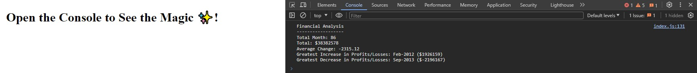

# Financial Analyzer

---

## Description

This project applies JavaScript skills learned in the web development bootcamp to analyze the financial records of a company, using a provided dataset.

### Understanding the Dataset:

The dataset comprises arrays with Date and Profit/Losses fields.

### JavaScript Code Implementation:

1. Code calculates the total number of months.
1. JavaScript determines the net total amount of Profit/Losses.
1. Monthly changes in Profit/Losses are tracked, and the average changes over the entire period are computed.
1. Code identifies the dates and differences for the greatest increase and decrease in Profit/Losses.

### Running the Code:

To execute the financial analysis, follow this [link](https://natves.github.io/Console-Finances/) and open the Chrome DevTools by pressing Command+Option+I (macOS) or Control+Shift+I (Windows). A console panel should open either below or to the side of the webpage in the browser where you can see the metrics about the financial records obtained using Console-Finances code.

The following image shows the result of executing the JS code

## Credits

I'd like to acknowledge [W3Schools](https://www.w3schools.com) and [MDN Web Docs](https://developer.mozilla.org/en-US/) for creating invaluable resources.

## License

Please refer to the LICENSE in the repo.

